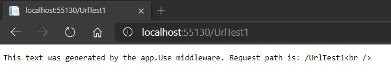

# Module 3: Configuring Middleware and Services in ASP.NET Core

# Lesson 1: Configuring Middleware

### Demonstration: How to Create Custom Middleware

Añadimos el metodo **configure** :


```cs
    public void Configure(IApplicationBuilder app)
    {
        app.Run(async (context) =>
        {
            await context.Response.WriteAsync("This text was generated by the app.Run middleware.");
        });
    }
```

Comprobamos la salida:


Añadimos el siguiente  codigo delante del anterior

```cs
    app.Use(async (context, next) =>
    {
        await context.Response.WriteAsync("This text was generated by the app.Use middleware. Request path is: " + context.Request.Path.Value + "<br />");
    });
```


vemos que solo se ejecuta este




Incluimos antes del cierre de llaves del codigo anterior el siguiente codigo:

```cs
    await next.Invoke();
```

Comprobamos que se ejecutan los dos


### Demonstration: How to Work with Static Files


- Creamos un nuevo proyecto

- Añadimos dos ficheros en la carpeta wwwroot

- En el middleware añadimos el metodo configure

  

```cs
    public void Configure(IApplicationBuilder app)
    {
        app.Run(async (context) =>
        {
            await context.Response.WriteAsync("This text was generated by the app.Run middleware.");
        });
    }
```


EJecutamos:


Colocamos en el metodo configure el siguiente codigo delante del anterior:

```cs
    app.UseStaticFiles();
```


Ejecutamos:


